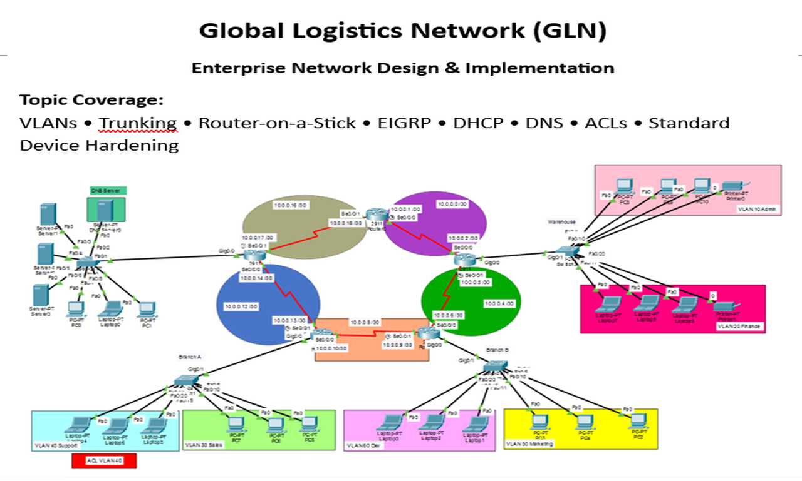

# multi-branch-enterprise-network
## Overview

Designed and configured an enterprise network connecting multiple branches across different countries.

## Technologies

- VLANs
- Router-on-a-Stick
- EIGRP
- DHCP
- DNS
- ACLs

## Network Topology

